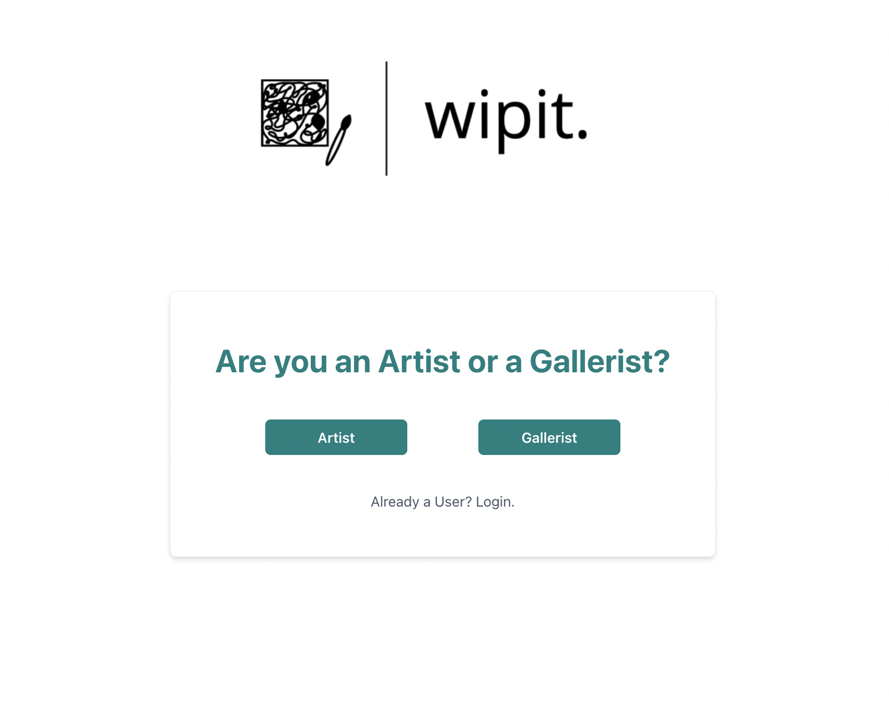
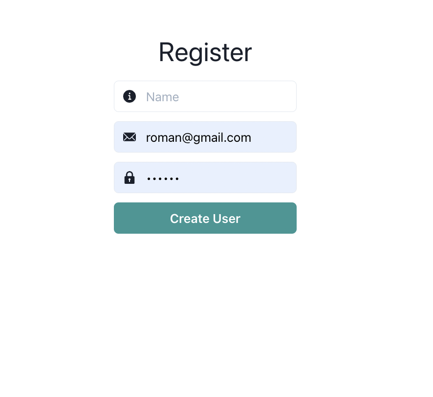
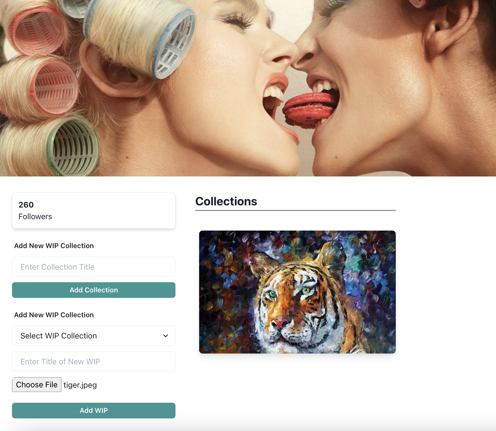

<p align="center">
  
</p>

Wipit is website that makes interaction between artists and gallerists easier.

## Screenshots

<p align="center">
  
  
  
  
</p>


## Getting started

Except for the regular suspects - git, Node, npm, etc - you need these things to run the All For One app. Follow the instructions supplied on their links before you continue with *Installation*.

* Postgres database, download and install from [here](https://www.postgresql.org/download/).


## Installation

1. Clone the repo

```
git clone https://github.com/Fatima031598/wipit
cd wipit
```

2. Install dependencies
```
cd client/wip-app
npm install
```

1. Start the server
```
cd server
npm install
npx nodemon
```

4. Start development server
```
cd client/wip-app
npm start
```

5. Scan the barcode with the Expo app on your phone or follow the terminal instructions to load up the simulator on your machine.

 ## Tech Stack
 [React](https://reactjs.org/), [JavaScript](https://www.javascript.com/), [Express](https://expressjs.com/), [PostgreSQL](https://www.postgresql.org/), [Sequelize](https://sequelize.org/), [Chakra-ui](https://chakra-ui.com/)


 ## Contributing

Improvements are welcome :)

Fork the repo and do your thing. Push to your fork and submit a pull request.


## Developers

* Fatima Tapiya - [Github](https://github.com/Fatima031598) - [LinkedIn](https://www.linkedin.com/in/fatima-tapiya/)
* Savannah Manning - [GitHub](https://github.com/savhappy) - [LinkedIn](https://www.linkedin.com/search/results/all/?keywords=savannah%20manning&origin=RICH_QUERY_SUGGESTION&position=0&searchId=0ff5c9a9-ea99-4b7f-80a7-64bdd46ae412&sid=zM)
* Dane Johnson - [GitHub](https://github.com/Rudy451) - [LinkedIn](https://www.linkedin.com/in/dane-johnson-aa3606111/)

